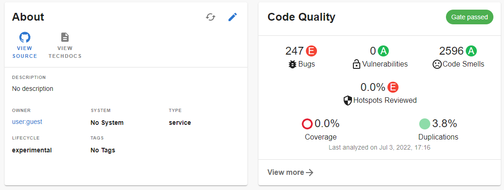
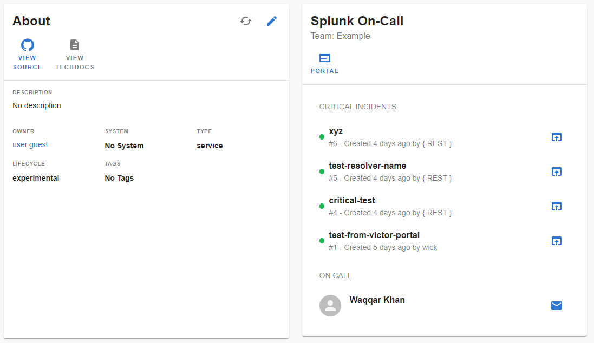

# Welcome to Developer Portal Doc

---

## SonarQube Plugin

The SonarQube Plugin displays code statistics from [SonarCloud](https://sonarcloud.io) or [SonarQube](https://sonarqube.com).



### Getting Started

- Install the SonarQube Plugin:

```bash
# From your MDP root directory
yarn add --cwd packages/app @backstage/plugin-sonarqube
```

- Add the `EntitySonarQubeCard` to the EntityPage:

```diff
  // packages/app/src/components/catalog/EntityPage.tsx
+ import { EntitySonarQubeCard } from '@backstage/plugin-sonarqube';

 ...

 const overviewContent = (
   <Grid container spacing={3} alignItems="stretch">
     <Grid item md={6}>
       <EntityAboutCard variant="gridItem" />
     </Grid>
+    <Grid item md={6}>
+      <EntitySonarQubeCard variant="gridItem" />
+    </Grid>
   </Grid>
 );
```

- Add the proxy config:

   Provide a method for your MDP backend to get to your SonarQube API end point. Add configuration to your `app-config.yaml` file depending on the product you use. Make sure to keep the trailing colon after the `SONARQUBE_TOKEN`, it is required to call
   the Web API (see [docs](https://docs.sonarqube.org/latest/extend/web-api/)).

**SonarCloud**

```yaml
proxy:
  "/sonarqube":
    target: https://sonarcloud.io/api
    allowedMethods: ["GET"]
    # note that the colon after the token is required
    auth: "${SONARQUBE_TOKEN}:"
    # Environmental variable: SONARQUBE_TOKEN
    # Fetch the sonar-auth-token from https://sonarcloud.io/account/security/
```

**SonarQube**

```yaml
proxy:
  "/sonarqube":
    target: https://your.sonarqube.instance.com/api
    allowedMethods: ["GET"]
    # note that the colon after the token is required
    auth: "${SONARQUBE_TOKEN}:"
    # Environmental variable: SONARQUBE_TOKEN
    # Fetch the sonar-auth-token from https://sonarcloud.io/account/security/

sonarQube:
  baseUrl: https://your.sonarqube.instance.com
```

- Get and provide `SONARQUBE_TOKEN` as an env variable (https://sonarcloud.io/account/security or https://docs.sonarqube.org/latest/user-guide/user-token/).

- Run the following commands in the root folder of the project to install and compile the changes.

```yaml
yarn install
yarn tsc
```

- Add the `sonarqube.org/project-key` annotation to the `catalog-info.yaml` file of the target repo for which code quality analysis is needed.

```yaml
apiVersion: backstage.io/v1alpha1
kind: Component
metadata:
  name: MDP
  description: |
    MDP is a developer portal that puts the developer experience first.
  annotations:
    sonarqube.org/project-key: YOUR_PROJECT_KEY
spec:
  type: library
  owner: CNCF
  lifecycle: experimental
```
---

## Splunk On-Call



### Overview

This plugin displays Splunk On-Call (formerly VictorOps) information associated with an entity.

It also provides the ability to trigger new incidents to specific users and/or specific teams from within MDP.

This plugin requires that entities feature either a `splunk.com/on-call-team` or a `splunk.com/on-call-routing-key` annotation. See below for further details.

This plugin provides:

- A list of incidents
- A way to trigger a new incident to specific users and/or teams
- A way to acknowledge/resolve an incident
- Information details about the persons on-call

### Setup instructions

Install the plugin:

```bash
# From your MDP root directory
yarn add --cwd packages/app @backstage/plugin-splunk-on-call
```

Add it to your `EntityPage`:

```ts
// packages/app/src/components/catalog/EntityPage.tsx
import {
  isSplunkOnCallAvailable,
  EntitySplunkOnCallCard,
} from '@backstage/plugin-splunk-on-call';
// ...
const overviewContent = (
  <Grid container spacing={3} alignItems="stretch">
    <EntitySwitch>
      <EntitySwitch.Case if={isSplunkOnCallAvailable}>
        <Grid item md={6}>
          <EntitySplunkOnCallCard />
        </Grid>
      </EntitySwitch.Case>
    </EntitySwitch>
```

**`readOnly` mode**

To suppress the rendering of the actionable create-acknowledge-resolve incident buttons and UI controls, the `EntitySplunkOnCallCard` can also be instantiated in `readOnly` mode:

```ts
<EntitySplunkOnCallCard readOnly />
```

### Client configuration

In order to be able to perform certain actions (create-acknowledge-resolve an action), you need to provide a REST Endpoint.

To enable the REST Endpoint integration you can go on https://portal.victorops.com/ inside Integrations > 3rd Party Integrations > REST – Generic.
You can now copy the URL to notify: `<SPLUNK_ON_CALL_REST_ENDPOINT>/$routing_key`

In `app-config.yaml`:

```yaml
splunkOnCall:
  eventsRestEndpoint: <SPLUNK_ON_CALL_REST_ENDPOINT>
```

In order to make the API calls, you need to provide a new proxy config which will redirect to the Splunk On-Call API endpoint and add authentication information in the headers:

```yaml
# app-config.yaml
proxy:
  # ...
  "/splunk-on-call":
    target: https://api.victorops.com/api-public
    headers:
      X-VO-Api-Id: ${SPLUNK_ON_CALL_API_ID}
      X-VO-Api-Key: ${SPLUNK_ON_CALL_API_KEY}
```

In addition, to make certain API calls (trigger-resolve-acknowledge an incident) you need to add the `PATCH` method to the backend `cors` methods list: `[GET, POST, PUT, DELETE, PATCH]`.

**WARNING**: In current implementation, the Splunk OnCall plugin requires the `/splunk-on-call` proxy endpoint be exposed by the MDP backend as an unprotected endpoint, in effect enabling Splunk OnCall API access using the configured `SPLUNK_ON_CALL_API_KEY` for any user or process with access to the `/splunk-on-call` MDP backend endpoint. See below for further configuration options enabling protection of this endpoint. If you regard this as problematic, consider using the plugin in `readOnly` mode (`<EntitySplunkOnCallCard readOnly />`) using the following proxy configuration:

```yaml
proxy:
  "/splunk-on-call":
    target: https://api.victorops.com/api-public
    headers:
      X-VO-Api-Id: ${SPLUNK_ON_CALL_API_ID}
      X-VO-Api-Key: ${SPLUNK_ON_CALL_API_KEY}
    # prohibit the `/splunk-on-call` proxy endpoint from servicing non-GET requests
    allowedMethods: ["GET"]
```

### Adding your team name to the entity annotation

The information displayed for each entity is based on either an associated team name or an associated routing key.

To use this plugin for an entity, the entity must be labeled with either a `splunk.com/on-call-team` or a `splunk.com/on-call-routing-key` annotation.

For example, by specifying a `splunk.com/on-call-team`, the plugin displays Splunk On-Call data associated with the specified team:

```yaml
annotations:
  splunk.com/on-call-team: <SPLUNK_ON_CALL_TEAM_NAME>
```

Alternatively, by specifying a `splunk.com/on-call-routing-key`, the plugin displays Splunk On-Call data associated with _each_ of the teams associated with the specified routing key:

```yaml
annotations:
  splunk.com/on-call-routing-key: <SPLUNK_ON_CALL_ROUTING_KEY>
```

### Create the Routing Key

To be able to use the REST Endpoint seen above, you must have created a routing key with the **same name** as the provided team.

You can create a new routing key on https://portal.victorops.com/ by going to Settings > Routing Keys.

You can read [Create & Manage Alert Routing Keys](https://help.victorops.com/knowledge-base/routing-keys/#routing-key-tips-tricks) for further information.

### Providing the API key and API id

In order for the client to make requests to the [Splunk On-Call API](https://portal.victorops.com/public/api-docs.html#/) it needs an [API ID and an API Key](https://help.victorops.com/knowledge-base/api/).

Then start the backend passing the values as an environment variable:

```bash
$ SPLUNK_ON_CALL_API_KEY='' SPLUNK_ON_CALL_API_ID='' yarn start
```

This will proxy the request by adding `X-VO-Api-Id` and `X-VO-Api-Key` headers with the provided values.
